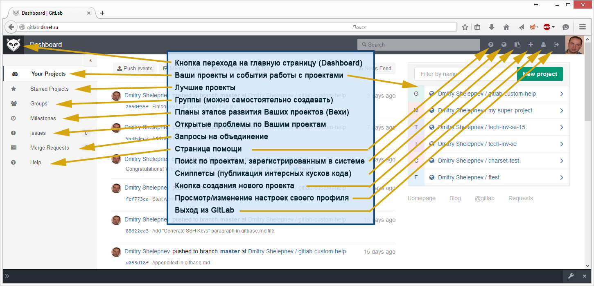
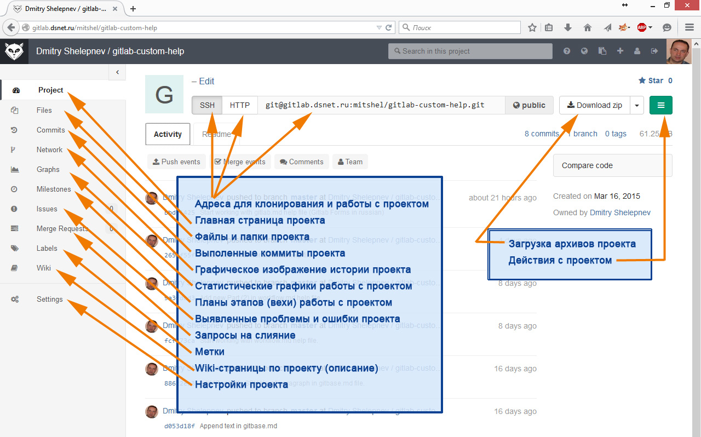

## Основные приемы работы с Web-интерфейсом GitLab.

### Основной экран GitLab:  

### Экран выбранного проекта: 
При выборе проекта в правой части основного экрана можно перейти на основной экран работы с выбранным проектом:   

