## Установка GIT в Windows.  

Установка Git в Windows очень проста. У проекта msysGit процедура установки ― одна из самых простых. 

### Экранные формы инсталлятора Git 2.6.3 для Windows:   

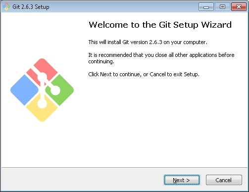   
Рисунок 1. Начало инсталляции Git.  
  

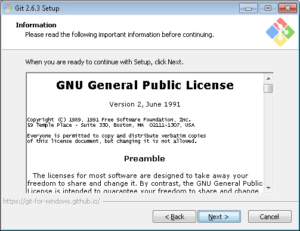  
Рисунок 2. Читаем GNU GPL.  

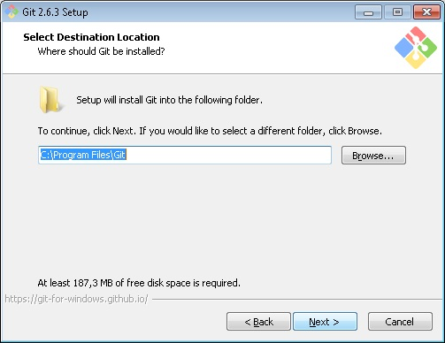  
Рисунок 3. Оставляем по умолчанию путь для установки GIT.
  

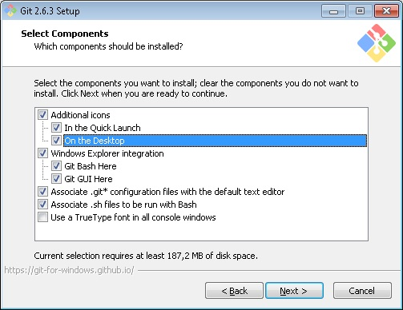  
Рисунок 4. Выбираем интеграцию ярлыков Git-Bash и Git-GUI в Windows Explorer и выносим на Рабочий стол и Меню Пуск ярлыки для запуска утилит GIT.   

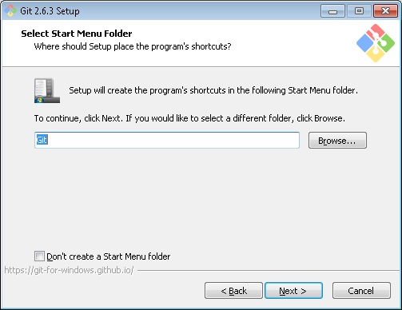  
Рисунок 5. Указываем название для папки с ярлыками для GIT в меню Пуск.
  

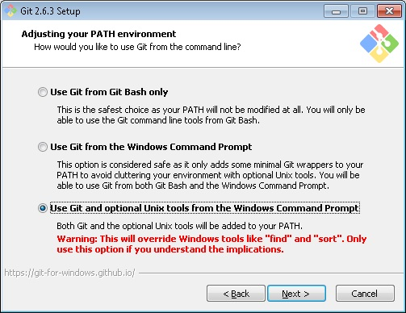  
Рисунок 6. Выбором третьей опции включаем в переменную PATH путь к Git и к Unix-утилитам (например нам понадобится далее ssh-keygen).  
  

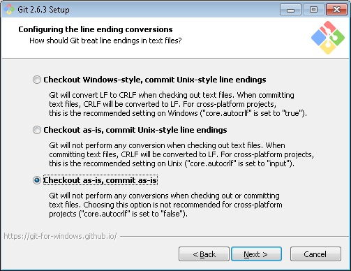  
Рисунок 7. Выбираем Checkout as-is, commit as-is. Т.е. не допускаем преобразований CRLF, т.к. не разрабатываем кросс-платформенные приложения.  

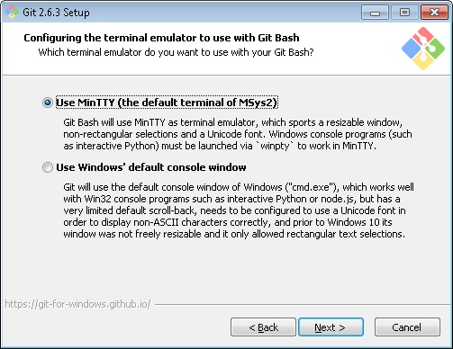  
Рисунок 8. Для работы с Git лучше использовать MinTTY. В этом случае на мой взгляд терминальное окно вызываем контекстной командой Git-Bash будет удобней для работы с Git.

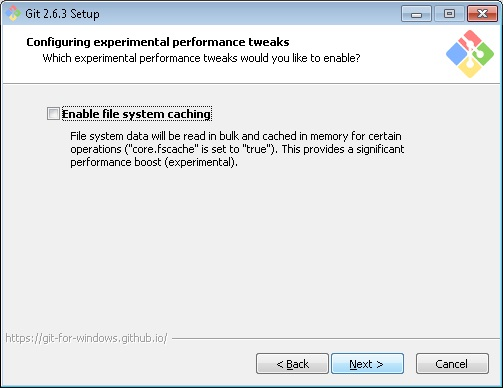  
Рисунок 9. Экспериментальную возможность кэширования файловой системы использовать не будем.

  
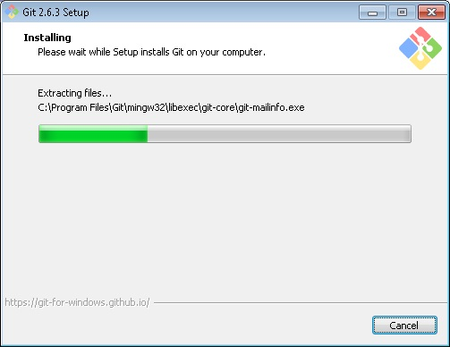  
Рисунок 10. Процесс инсталляции.  
  

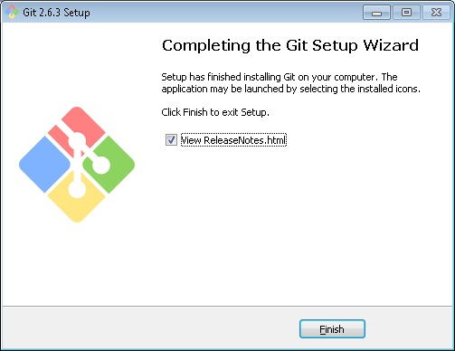  
Рисунок 11. Завершение установки.  

